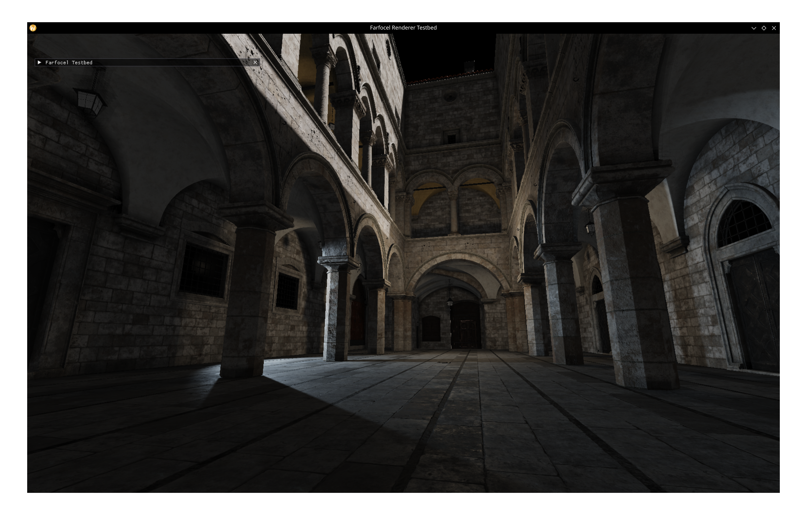

# Farfocel

Monorepo of the Farfocel Game Engine.

Farfocel Renderer Testbed:

See:
- [**Engine**](engine/README.md) - the real Farfocel
- [Asscooker](asscooker/READMEN.d) - asset loader and compiler (the worst part from this entire project)
- [Editor](editor/README.md) - will likely not exist
- [Examples](examples) - for now, a primary way to test the engine. For something visual, check [Renderer Testbed](examples/renderer/). Run from top directory: `./bin/farfocel_example_renderer_testbed`

Authors:
- [Jakub Kijek (Kiju)](https://github.com/kijudev)
- [Karol Szypuła (Tfoedy)](https://github.com/Tfoedy)
- [Stanisław Dera](https://github.com/stanislawdera)

Please note that we have a crazy ass deadline, and so, the code quality may vary, but this is all intentional.

### Third party libraries
See [third party libraries](3rdparty/README.md) used in Farfocel.

### Build
See [building instructions](BUILDING.md).
